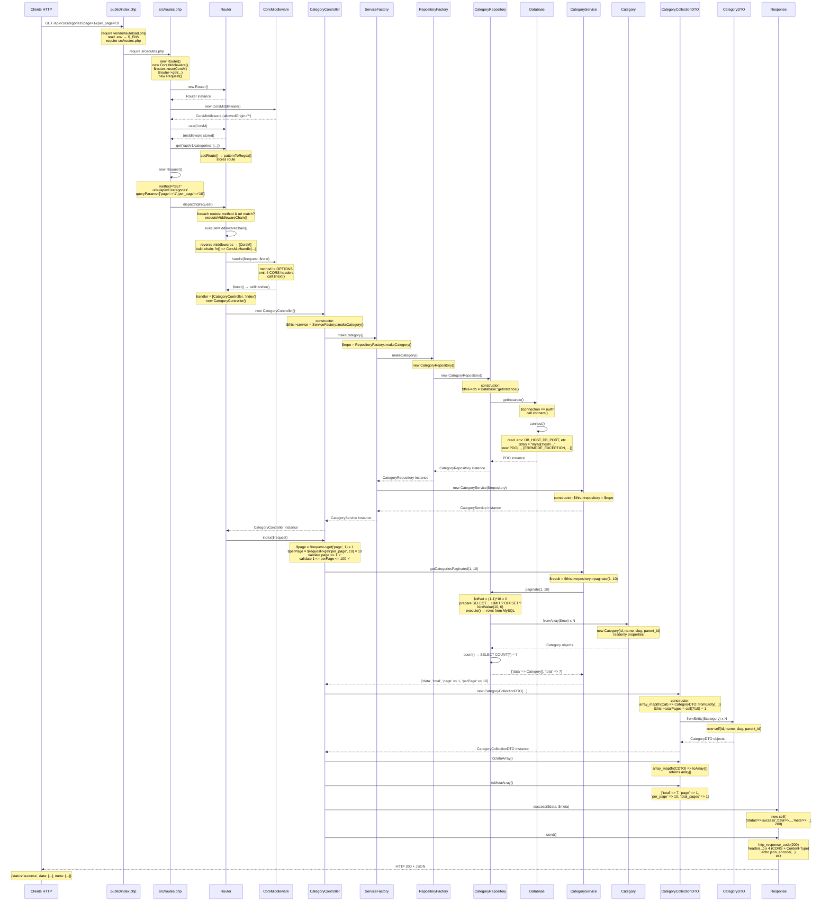

# ApiProject - Guía Completa del Flujo de Solicitudes

API REST pura en PHP 8.2 sin frameworks, con arquitectura profesional en capas.

**Características:**
- Catálogo de 20+ productos
- Sistema de inventario con movimientos de entrada/salida
- Categorías jerárquicas de productos
- Gestión de proveedores
- Sistema de roles para usuarios (admin, manager, viewer)
- Base de datos completamente creada con datos de prueba

---

## Tabla de Contenidos

1. [Cómo funciona una solicitud HTTP](#cómo-funciona-una-solicitud-http)
2. [Flujo detallado: GET /api/v1/categories](#flujo-detallado-get-apiv1categories)
3. [Estructura del código](#estructura-del-código)
4. [Requisitos e instalación](#requisitos)

---

## Cómo funciona una solicitud HTTP

Cuando haces una solicitud GET a `http://localhost/api/v1/categories?page=1&per_page=10`, el servidor debe:

1. **Recibir** la solicitud HTTP
2. **Entender** qué endpoint está pidiendo
3. **Ejecutar** la lógica correcta
4. **Consultar** la base de datos
5. **Devolver** los resultados en formato JSON

Nuestro API hace exactamente eso, paso a paso.

---

## Flujo Detallado: GET /api/v1/categories

En esta sección rastreamos paso a paso qué ocurre cuando haces una solicitud GET a `/api/v1/categories?page=1&per_page=10`. Seguiremos el flujo línea a línea, y cuando una línea instancia una clase, entraremos en esa clase para ver qué sucede en su interior antes de continuar.

---

### 1. public/index.php — Punto de entrada (22 líneas)

El front controller de la aplicación. Todas las solicitudes HTTP llegan aquí primero.

```php
<?php

// Línea 4: Carga el autoloader de Composer
require dirname(__DIR__) . '/vendor/autoload.php';

// Línea 7-19: Lee el archivo .env y carga variables de entorno
$envPath = dirname(__DIR__) . '/.env';
if (file_exists($envPath)) {
    $lines = file($envPath, FILE_IGNORE_NEW_LINES | FILE_SKIP_EMPTY_LINES);
    foreach ($lines as $line) {
        if (strpos($line, '=') !== false && strpos($line, '#') !== 0) {
            list($key, $value) = explode('=', $line, 2);
            $key = trim($key);
            $value = trim($value);
            $_ENV[$key] = $value;
            putenv("$key=$value");
        }
    }
}

// Línea 22: Carga el archivo que define las rutas
require dirname(__DIR__) . '/src/routes.php';
```

**Qué sucede:**

- **Línea 4:** `require vendor/autoload.php` — Carga el autoloader de Composer, que permite usar cualquier clase de la carpeta `src/` automáticamente. Sin esta línea, PHP no sabría dónde buscar nuestras clases.
  
- **Líneas 7-19:** Se lee el archivo `.env` línea a línea. Por cada línea con formato `CLAVE=valor`, se extrae la pareja y se guarda en `$_ENV` (accesible globalmente) y se establece vía `putenv()` (para que `getenv()` también la encuentre).

- **Línea 22:** `require src/routes.php` — Carga el archivo que define todas las rutas de la API. Aquí comienza el verdadero flujo de la solicitud.

---

### 2. src/routes.php — Registro de rutas y despacho (28 líneas)

Este archivo instancia el Router, registra el middleware y las rutas, y finalmente despacha la solicitud actual.

```php
<?php

use App\Core\Request;
use App\Core\Router;
use App\Core\Response;
use App\Controllers\CategoryController;
use App\Middleware\CorsMiddleware;

// Línea 9: Crea una nueva instancia del Router
$router = new Router();

// Línea 12: Registra el middleware CORS
$router->use(new CorsMiddleware());

// Línea 22-23: Registra las rutas
$router->get('/api/v1/categories', [CategoryController::class, 'index']);
$router->get('/api/v1/categories/{id:\d+}', [CategoryController::class, 'show']);

// Línea 26-27: Crea el objeto Request y despacha la solicitud
$request = new Request();
$router->dispatch($request);
```

Ahora vamos línea a línea:

#### 2.1 Línea 9 — `$router = new Router()`

> **Entramos a `src/Core/Router.php`** (líneas 5-10)

El Router es una clase que no tiene constructor explícito. Cuando PHP instancia una clase sin constructor definido, simplemente inicializa las propiedades:

```php
class Router
{
    // Línea 8: Propiedad que almacena todas las rutas registradas
    private array $routes = [];
    
    // Línea 10: Propiedad que almacena todos los middlewares
    private array $middlewares = [];
}
```

Ambas propiedades se inicializan como arrays vacíos en el momento de la instanciación. No hay constructor implícito que ejecutar.

> **Regresamos a `src/routes.php`**

---

#### 2.2 Línea 12 — `new CorsMiddleware()`

> **Entramos a `src/Middleware/CorsMiddleware.php`** (líneas 13-16)

```php
public function __construct(string $allowedOrigin = '*')
{
    // Línea 15: Guarda el origen permitido
    $this->allowedOrigin = $allowedOrigin;
}
```

El constructor de `CorsMiddleware` recibe un parámetro `$allowedOrigin` (por defecto `'*'`, que significa todos los orígenes). En `routes.php` lo instanciamos sin argumentos: `new CorsMiddleware()`, así que `$this->allowedOrigin = '*'`.

> **Regresamos a `src/routes.php`**

---

#### 2.3 Línea 12 — `$router->use(new CorsMiddleware())`

> **Entramos a `src/Core/Router.php`** — Método `use()` (líneas 49-53)

```php
public function use(Middleware $middleware): self
{
    // Línea 51: Agrega el middleware al array
    $this->middlewares[] = $middleware;
    return $this;
}
```

El método `use()` simplemente agrega el middleware al array `$this->middlewares`. Cuando sea momento de procesar la solicitud, los middlewares se ejecutarán en el orden en que fueron registrados.

> **Regresamos a `src/routes.php`**

---

#### 2.4 Línea 22 — `$router->get('/api/v1/categories', ...)`

> **Entramos a `src/Core/Router.php`** — Método `get()` (líneas 12-15)

```php
public function get(string $pattern, mixed $handler): self
{
    // Línea 14: Delega al método genérico addRoute()
    return $this->addRoute('GET', $pattern, $handler);
}
```

El método `get()` simplemente llama a `addRoute()` con el método HTTP `'GET'`. Veamos `addRoute()`:

**Método `addRoute()`** (líneas 37-47)

```php
public function addRoute(string $method, string $pattern, mixed $handler): self
{
    $key = "$method $pattern";
    // Línea 40-45: Almacena la ruta en el array $routes
    $this->routes[$key] = [
        'method' => $method,
        'pattern' => $pattern,
        'regex' => $this->patternToRegex($pattern),  // Convierte patrón a regex
        'handler' => $handler,
    ];
    return $this;
}
```

La línea 43 llama a `patternToRegex()`:

**Método `patternToRegex()`** (líneas 83-97)

```php
private function patternToRegex(string $pattern): string
{
    // Línea 86-94: Busca tokens como {id:\d+} o {nombre}
    $regex = preg_replace_callback(
        '/{(\w+)(?::([^}]+))?}/',
        function ($matches) {
            $name = $matches[1];
            $constraint = $matches[2] ?? '\d+';
            return "(?P<$name>$constraint)";
        },
        $pattern
    );

    // Línea 96: Envuelve con delimitadores regex y anclas
    return "#^$regex$#";
}
```

En nuestro caso, `$pattern = '/api/v1/categories'` no contiene tokens `{...}`, así que la expresión regular no cambia nada. El resultado es `#^/api/v1/categories$#`, un patrón que coincide exactamente con esa URL.

> **Regresamos a `src/routes.php`**

---

#### 2.5 Línea 26 — `$request = new Request()`

> **Entramos a `src/Core/Request.php`** — Constructor (líneas 15-21)

```php
public function __construct()
{
    // Línea 17: Lee el método HTTP de la solicitud actual
    $this->method = $_SERVER['REQUEST_METHOD'];
    
    // Línea 18: Extrae la ruta de la URL (sin query string)
    $this->uri = parse_url($_SERVER['REQUEST_URI'], PHP_URL_PATH);
    
    // Línea 19: Copia los parámetros GET (?page=1&per_page=10)
    $this->queryParams = $_GET;
    
    // Línea 20: Normaliza los headers HTTP
    $this->headers = $this->parseHeaders();
}
```

Línea a línea:

- **Línea 17:** `$_SERVER['REQUEST_METHOD']` contiene `'GET'` (el método HTTP de la solicitud actual).

- **Línea 18:** `parse_url($_SERVER['REQUEST_URI'], PHP_URL_PATH)` extrae la ruta de `/api/v1/categories?page=1&per_page=10`, que es `/api/v1/categories` (sin el query string).

- **Línea 19:** `$_GET` es un array que PHP llena automáticamente con los parámetros query string: `['page' => '1', 'per_page' => '10']`.

- **Línea 20:** `parseHeaders()` itera `$_SERVER`, filtra claves que comienzan con `HTTP_` (como `HTTP_ACCEPT`, `HTTP_USER_AGENT`), convierte a minúsculas, quita el prefijo `HTTP_`, y construye un array de headers normalizados.

> **Regresamos a `src/routes.php`**

---

#### 2.6 Línea 27 — `$router->dispatch($request)`

> **Entramos a `src/Core/Router.php`** — Método `dispatch()` (líneas 55-81)

```php
public function dispatch(Request $request): void
{
    // Línea 57: Itera todas las rutas registradas
    foreach ($this->routes as $route) {
        // Línea 58-60: Verifica que el método HTTP coincida
        if ($route['method'] !== $request->method) {
            continue;
        }

        // Línea 62: Comprueba si la URL coincide con el patrón regex
        if (preg_match($route['regex'], $request->uri, $matches)) {
            // Línea 64-68: Extrae parámetros nombrados (si los hay)
            foreach ($matches as $key => $value) {
                if (!is_numeric($key)) {
                    $request->setAttribute($key, $value);
                }
            }

            // Línea 71-74: Ejecuta la cadena de middleware + handler
            $this->executeMiddlewareChain(
                $request,
                fn() => $this->callHandler($route['handler'], $request)
            );
            return;
        }
    }

    // Línea 79-80: Si no hay coincidencia, envía error 404
    Response::notFound('Endpoint not found')->send();
}
```

Análisis línea a línea para nuestra solicitud GET `/api/v1/categories`:

- **Línea 57:** Se itera `$this->routes`. Tenemos una ruta: `['method' => 'GET', 'pattern' => '/api/v1/categories', 'regex' => '#^/api/v1/categories$#', 'handler' => [CategoryController::class, 'index']]`.

- **Línea 58:** `'GET' !== 'GET'`? No, el método coincide. No se ejecuta `continue`.

- **Línea 62:** `preg_match('#^/api/v1/categories$#', '/api/v1/categories', $matches)` retorna `true` porque la URL coincide exactamente.

- **Línea 64-68:** `$matches` es un array numérico (por la coincidencia del regex). No hay claves nombradas (nuestro patrón no tiene `{id}`), así que no se ejecuta `setAttribute()`.

- **Línea 71-74:** Se llama a `executeMiddlewareChain()`, pasando el request y un callable que representará al handler.

> **Entramos a `executeMiddlewareChain()`** (líneas 99-110)

```php
private function executeMiddlewareChain(Request $request, callable $handler): void
{
    // Línea 101: Invierte el array de middlewares
    $middlewares = array_reverse($this->middlewares);

    // Línea 103: Inicia la cadena con el handler
    $chain = $handler;
    
    // Línea 104-107: Envuelve cada middleware en torno a la cadena
    foreach ($middlewares as $middleware) {
        $currentChain = $chain;
        $chain = fn() => $middleware->handle($request, $currentChain);
    }

    // Línea 109: Invoca el primer middleware (que invocará al siguiente, etc.)
    $chain();
}
```

Análisis:

- **Línea 101:** `array_reverse([CorsMiddleware]) = [CorsMiddleware]` (solo uno).

- **Línea 103:** `$chain = fn() => callHandler([CategoryController::class, 'index'], $request)` (el handler como callable).

- **Línea 104-107:** Para cada middleware, se construye una cadena anidada:
  ```
  $chain = fn() => CorsMiddleware->handle($request, fn() => callHandler(...))
  ```

- **Línea 109:** `$chain()` invoca el primer middleware.

> **Entramos a `CorsMiddleware::handle()`** (líneas 18-32)

```php
public function handle(Request $request, callable $next): void
{
    // Línea 21-23: Si es solicitud OPTIONS (preflight de CORS), responde directo
    if ($request->method === 'OPTIONS') {
        $this->sendPreflight();
    }

    // Línea 26-29: Agrega headers CORS a la respuesta
    header("Access-Control-Allow-Origin: {$this->allowedOrigin}");
    header('Access-Control-Allow-Methods: GET, POST, PUT, DELETE, PATCH, OPTIONS');
    header('Access-Control-Allow-Headers: Content-Type, Authorization, X-Requested-With');
    header('Access-Control-Max-Age: 86400');

    // Línea 31: Llama al siguiente paso (handler o siguiente middleware)
    $next();
}
```

Análisis:

- **Línea 21:** `$request->method === 'OPTIONS'`? No, es `'GET'`. Se omite el bloque preflight.

- **Líneas 26-29:** Se emiten 4 headers HTTP para CORS. Estos headers se enviarán al navegador para permitir solicitudes desde otros dominios.

- **Línea 31:** `$next()` invoca el callable que recibió. En nuestro caso, es `fn() => callHandler([CategoryController::class, 'index'], $request)`.

> **Entramos a `Router::callHandler()`** (líneas 112-127)

```php
private function callHandler(mixed $handler, Request $request): void
{
    // Línea 114-116: Si es una Closure (función anónima), la invoca directo
    if ($handler instanceof \Closure) {
        $handler($request);
        return;
    }

    // Línea 119-123: Si es un array [ControllerClass, 'methodName'], instancia y llama
    if (is_array($handler) && count($handler) === 2) {
        [$controller, $method] = $handler;
        $instance = new $controller();  // ← Instancia el controller
        $instance->$method($request);
        return;
    }

    // Línea 126: Si el handler no es válido, lanza excepción
    throw new \RuntimeException('Invalid handler type');
}
```

Análisis para nuestro caso:

- **Línea 114:** `$handler` no es una Closure (es un array). Se omite el bloque.

- **Línea 119:** `$handler = [CategoryController::class, 'index']` es un array de 2 elementos. Coincide.

- **Línea 120:** Se desestructura: `$controller = 'App\Controllers\CategoryController'`, `$method = 'index'`.

- **Línea 121:** `$instance = new CategoryController()`. Aquí instanciamos el controller, lo que activa su constructor.

> **Entramos a `src/Controllers/CategoryController.php`** — Constructor (líneas 16-19)

```php
public function __construct()
{
    // Línea 18: Llama a la Factory para crear el servicio
    $this->service = ServiceFactory::makeCategory();
}
```

El constructor solo hace una cosa: inyecta el servicio vía Factory. Veamos qué sucede en `ServiceFactory::makeCategory()`:

> **Entramos a `src/Factories/ServiceFactory.php`** (líneas 9-13)

```php
public static function makeCategory(): CategoryService
{
    // Línea 11: Crea el repositorio
    $repository = RepositoryFactory::makeCategory();
    // Línea 12: Inyecta el repositorio en el servicio
    return new CategoryService($repository);
}
```

- **Línea 11:** `RepositoryFactory::makeCategory()` crea el repositorio.

> **Entramos a `src/Factories/RepositoryFactory.php`** (líneas 9-12)

```php
public static function makeCategory(): CategoryRepository
{
    return new CategoryRepository();
}
```

Instancia directamente el `CategoryRepository`:

> **Entramos a `src/Repositories/CategoryRepository.php`** — Constructor (líneas 13-16)

```php
public function __construct()
{
    // Línea 15: Obtiene la conexión a BD (Singleton)
    $this->db = Database::getInstance();
}
```

- **Línea 15:** `Database::getInstance()` retorna la conexión PDO (crea una si no existe).

> **Entramos a `src/Core/Database.php`** — Método `getInstance()` (líneas 13-19)

```php
public static function getInstance(): PDO
{
    // Línea 15: Si la conexión no existe, la crea
    if (self::$connection === null) {
        self::connect();
    }
    // Línea 18: Retorna la conexión
    return self::$connection;
}
```

Primera vez que se llama, `self::$connection === null` es `true`. Se invoca `connect()`:

> **Entramos a `Database::connect()`** (líneas 21-40)

```php
private static function connect(): void
{
    try {
        // Línea 24-28: Lee credenciales de .env
        $host = getenv('DB_HOST');        // e.g. 'mysql'
        $port = getenv('DB_PORT') ?: 3306; // e.g. 3306
        $database = getenv('DB_DATABASE'); // e.g. 'api_db'
        $username = getenv('DB_USERNAME'); // e.g. 'api_user'
        $password = getenv('DB_PASSWORD'); // e.g. 'secret'

        // Línea 30: Construye la cadena de conexión (DSN)
        $dsn = "mysql:host=$host;port=$port;dbname=$database;charset=utf8mb4";
        // Ejemplo: "mysql:host=mysql;port=3306;dbname=api_db;charset=utf8mb4"

        // Línea 32-36: Crea la conexión PDO
        self::$connection = new PDO(
            $dsn,
            $username,
            $password,
            [
                PDO::ATTR_ERRMODE => PDO::ERRMODE_EXCEPTION,     // Lanza excepciones en errores
                PDO::ATTR_DEFAULT_FETCH_MODE => PDO::FETCH_ASSOC, // Resultados como arrays asociativos
                PDO::ATTR_EMULATE_PREPARES => false,              // Usa prepared statements reales de MySQL
            ]
        );
    } catch (PDOException $e) {
        // Si hay error de conexión, envía HTTP 500 y detiene
        Response::error('Database connection failed', 500)->send();
    }
}
```

Análisis de cada atributo PDO:

- **ERRMODE_EXCEPTION:** Si hay error en la base de datos, lanza una excepción en lugar de devolver `false`.

- **FETCH_ASSOC:** Los resultados de las consultas se devuelven como arrays asociativos (claves como nombres de columnas).

- **EMULATE_PREPARES = false:** Usa prepared statements reales del servidor MySQL (más seguro contra SQL injection).

> **Regresamos a `getInstance()`:** Línea 18 retorna `self::$connection` (la conexión PDO creada).

> **Regresamos a `CategoryRepository`:** Constructor línea 15 asigna `$this->db = PDO instance`.

> **Regresamos a `RepositoryFactory`:** Retorna la instancia de `CategoryRepository`.

> **Entramos a `src/Services/CategoryService.php`** — Constructor (líneas 12-15)

```php
public function __construct(CategoryRepository $repository)
{
    // Línea 14: Guarda el repositorio (inyección de dependencias)
    $this->repository = $repository;
}
```

- **Línea 14:** Se guarda la referencia al repositorio para usarla después.

> **Regresamos a `ServiceFactory`:** Retorna la instancia de `CategoryService`.

> **Regresamos a `CategoryController`:** Constructor línea 18 asigna `$this->service = CategoryService instance`.

> **Regresamos a `callHandler`:** Línea 122 invoca `$instance->index($request)`.

---

### 3. src/Controllers/CategoryController.php — Método `index()` (líneas 22-43)

```php
public function index(Request $request): void
{
    // Línea 24: Lee parámetro GET ?page, valor por defecto 1
    $page = (int)$request->get('page', 1);
    
    // Línea 25: Lee parámetro GET ?per_page, valor por defecto 10
    $perPage = (int)$request->get('per_page', 10);

    // Línea 27-29: Si page < 1, responde con error 422
    if ($page < 1) {
        Response::validationError(['page' => 'Must be >= 1'])->send();
    }
    
    // Línea 30-32: Si per_page no está entre 1 y 100, responde con error 422
    if ($perPage < 1 || $perPage > 100) {
        Response::validationError(['per_page' => 'Must be between 1 and 100'])->send();
    }

    // Línea 34: Obtiene los datos paginados del servicio
    $result = $this->service->getCategoriesPaginated($page, $perPage);

    // Línea 35-40: Empaqueta los datos en un DTO
    $collection = new CategoryCollectionDTO(
        categories: $result['data'],
        total:      $result['total'],
        page:       $result['page'],
        perPage:    $result['perPage'],
    );

    // Línea 42: Responde con JSON y termina
    Response::success($collection->toDataArray(), $collection->toMetaArray())->send();
}
```

Análisis línea a línea:

- **Línea 24:** `$request->get('page', 1)` busca en `$_GET` la clave `'page'`. Si no existe, usa `1`. Se castea a `(int)` para convertir el string `'1'` a entero.

- **Línea 25:** Igual para `'per_page'`, defecto `10`.

- **Línea 27-29:** Si `$page < 1`, se envía un error de validación (HTTP 422). El método `send()` detiene la ejecución aquí.

- **Línea 30-32:** Si `$perPage` está fuera del rango `[1, 100]`, igual error.

- **Línea 34:** Se llama al servicio para obtener los datos con paginación.

> **Entramos a `src/Services/CategoryService.php`** — Método `getCategoriesPaginated()` (líneas 40-50)

```php
public function getCategoriesPaginated(int $page = 1, int $perPage = 10): array
{
    // Línea 42: Llama al repositorio
    $result = $this->repository->paginate($page, $perPage);

    // Línea 44-49: Retorna los datos formateados
    return [
        'data'    => $result['data'],
        'total'   => $result['total'],
        'page'    => $page,
        'perPage' => $perPage,
    ];
}
```

- **Línea 42:** El repositorio obtiene los datos de la BD.

> **Entramos a `src/Repositories/CategoryRepository.php`** — Método `paginate()` (líneas 58-80)

```php
public function paginate(int $page = 1, int $perPage = 10): array
{
    // Línea 60: Calcula el offset (número de registros a saltar)
    $offset = ($page - 1) * $perPage;
    // Ejemplo: page=1, perPage=10 → offset=0

    // Línea 62-67: Prepara la consulta SQL con placeholders
    $stmt = $this->db->prepare('
        SELECT id, name, slug, parent_id
        FROM categories
        ORDER BY id ASC
        LIMIT ? OFFSET ?
    ');
    
    // Línea 68-70: Vincula valores a los placeholders (? en la query)
    $stmt->bindValue(1, $perPage, PDO::PARAM_INT);   // LIMIT ?
    $stmt->bindValue(2, $offset, PDO::PARAM_INT);    // OFFSET ?
    $stmt->execute();

    // Línea 72: Obtiene todos los resultados como arrays asociativos
    $rows = $stmt->fetchAll();

    // Línea 73: Convierte cada array en un objeto Category
    $categories = array_map(
        fn(array $row) => Category::fromArray($row),
        $rows
    );
    
    // Línea 74: Obtiene el total de registros (sin límite)
    $total = $this->count();

    // Línea 76-79: Retorna los datos paginados
    return [
        'data' => $categories,
        'total' => $total,
    ];
}
```

Análisis:

- **Línea 60:** Si `page=1` y `perPage=10`, entonces `offset = (1-1)*10 = 0`. Así se obtienen los registros 1-10.

- **Línea 62-67:** Se prepara la query con dos placeholders `?`. Los placeholders previenen SQL injection porque los valores se envían separadamente de la query.

- **Línea 68-70:** Se vinculan los valores. `bindValue(1, ...)` vincula al primer `?` (LIMIT), `bindValue(2, ...)` al segundo `?` (OFFSET).

- **Línea 70:** `execute()` ejecuta la consulta en MySQL y retorna un objeto que permite acceder a los resultados.

- **Línea 72:** `fetchAll()` obtiene todos los resultados. Con `PDO::FETCH_ASSOC`, cada resultado es un array como:
  ```php
  ['id' => 1, 'name' => 'Electrónica', 'slug' => 'electronica', 'parent_id' => null]
  ```

- **Línea 73:** Para cada array `$row`, se invoca `Category::fromArray($row)` para convertirlo a un objeto `Category`.

> **Entramos a `src/Models/Category.php`** — Método `fromArray()` (líneas 17-25)

```php
public static function fromArray(array $data): self
{
    return new self(
        id: (int)$data['id'],
        name: (string)$data['name'],
        slug: (string)$data['slug'],
        parent_id: $data['parent_id'] ? (int)$data['parent_id'] : null,
    );
}
```

- Se crea un nuevo objeto `Category` con los datos del array.
- `parent_id` es `null` si el valor es 0, `false`, o vacío; de lo contrario, se castea a entero.
- Las propiedades son `readonly`, así que el objeto es inmutable una vez creado.

> **Regresamos a `paginate()`:** Línea 74 obtiene el total de registros.

- **Línea 74:** `$this->count()` ejecuta `SELECT COUNT(*) FROM categories` y retorna el número total de registros (sin paginación).

> **Regresamos a `CategoryService`:** El array retornado es `['data' => Category[], 'total' => int]`. Se le agregan `'page'` y `'perPage'`.

> **Regresamos a `CategoryController::index()`:** Línea 35-40 crea el DTO.

```php
$collection = new CategoryCollectionDTO(
    categories: $result['data'],     // Category[]
    total:      $result['total'],    // int
    page:       $result['page'],     // int
    perPage:    $result['perPage'],  // int
);
```

> **Entramos a `src/DTOs/CategoryCollectionDTO.php`** — Constructor (líneas 20-34)

```php
public function __construct(
    array $categories,
    int   $total,
    int   $page,
    int   $perPage,
) {
    // Línea 26-29: Convierte cada Category en CategoryDTO
    $this->items = array_map(
        fn(Category $c) => CategoryDTO::fromEntity($c),
        $categories
    );
    
    // Línea 30-33: Almacena los metadatos de paginación
    $this->total      = $total;
    $this->page       = $page;
    $this->perPage    = $perPage;
    $this->totalPages = (int) ceil($total / $perPage);
}
```

Análisis:

- **Línea 26-29:** Para cada objeto `Category`, se invoca `CategoryDTO::fromEntity($c)` para convertirlo en un `CategoryDTO` (un objeto de solo lectura para la serialización).

> **Entramos a `src/DTOs/CategoryDTO.php`** — Método `fromEntity()` (líneas 16-24)

```php
public static function fromEntity(Category $category): self
{
    return new self(
        id:        $category->id,
        name:      $category->name,
        slug:      $category->slug,
        parent_id: $category->parent_id,
    );
}
```

- Copia los datos del modelo `Category` a un `CategoryDTO`.

> **Regresamos a `CategoryCollectionDTO`:**

- **Línea 30-33:** Se guardan los metadatos. Especialmente `$this->totalPages = (int)ceil($total / $perPage)` calcula cuántas páginas hay en total.

> **Regresamos a `CategoryController::index()`:** Línea 42 envía la respuesta.

```php
Response::success($collection->toDataArray(), $collection->toMetaArray())->send();
```

Primero se transforman los datos:

- `$collection->toDataArray()`: Retorna un array de arrays planos (cada `CategoryDTO` → array).
- `$collection->toMetaArray()`: Retorna los metadatos `['total', 'page', 'per_page', 'total_pages']`.

> **Entramos a `src/Core/Response.php`** — Método `success()` (líneas 17-24)

```php
public static function success(array $data, array $meta = null, int $statusCode = 200): self
{
    return new self([
        'status' => 'success',
        'data' => $data,
        'meta' => $meta,
    ], $statusCode);
}
```

- Crea una instancia de `Response` con la estructura JSON: `{status: 'success', data: [...], meta: {...}}` y código HTTP 200.

Luego se invoca `send()`:

> **Entramos a `Response::send()`** (líneas 64-74)

```php
public function send(): void
{
    // Línea 66: Establece el código HTTP de la respuesta
    http_response_code($this->statusCode);

    // Línea 68-70: Emite cada header
    foreach ($this->headers as $key => $value) {
        header("$key: $value");
    }

    // Línea 72: Serializa los datos a JSON y los imprime
    echo json_encode(
        $this->data,
        JSON_UNESCAPED_UNICODE | JSON_UNESCAPED_SLASHES
    );
    
    // Línea 73: Detiene la ejecución del script
    exit;
}
```

Análisis final:

- **Línea 66:** `http_response_code(200)` establece que la respuesta es HTTP 200 OK.

- **Línea 68-70:** Se emiten los headers. El más importante es `Content-Type: application/json; charset=utf-8` (ya seteado por defecto en el constructor de `Response`).

- **Línea 72:** `json_encode($this->data, ...)` convierte el array PHP a JSON:
  - `JSON_UNESCAPED_UNICODE`: Preserva caracteres acentuados (ej: "Electrónica" en lugar de "\u00e9").
  - `JSON_UNESCAPED_SLASHES`: No escapa barras (ej: "/" en lugar de "\/").

- **Línea 73:** `exit` termina la ejecución del script. Nada más se ejecuta después.

---

### 4. Respuesta final al cliente

El navegador o cliente recibe:

```
HTTP/1.1 200 OK
Content-Type: application/json; charset=utf-8
Access-Control-Allow-Origin: *
[otros headers...]

{
  "status": "success",
  "data": [
    {
      "id": 1,
      "name": "Electrónica",
      "slug": "electronica",
      "parent_id": null
    },
    ...
  ],
  "meta": {
    "total": 7,
    "page": 1,
    "per_page": 10,
    "total_pages": 1
  }
}
```

---

### 5. Diagrama de secuencia



---

## Ejemplo de respuesta JSON

Solicitud:
```bash
GET /api/v1/categories?page=1&per_page=2
```

Respuesta:
```json
{
  "status": "success",
  "data": [
    {
      "id": 1,
      "name": "Electrónica",
      "slug": "electronica",
      "parent_id": null
    },
    {
      "id": 2,
      "name": "Smartphones",
      "slug": "smartphones",
      "parent_id": 1
    }
  ],
  "meta": {
    "total": 7,
    "page": 1,
    "per_page": 2,
    "total_pages": 4
  }
}
```

---

## Estructura del código

Archivos involucrados en el flujo GET /api/v1/categories:

```
public/
├── index.php                         Front Controller (punto de entrada)
└── .htaccess                         Redirige URLs a index.php

src/
├── Core/
│   ├── Database.php                 Conexión PDO (Singleton)
│   ├── Request.php                  Objeto HTTP Request
│   ├── Response.php                 Objeto HTTP Response
│   ├── Router.php                   Enrutador de solicitudes
│   └── Middleware.php               Interfaz de middleware
├── Middleware/
│   └── CorsMiddleware.php           Headers CORS
├── Controllers/
│   └── CategoryController.php       HTTP Handler
├── Services/
│   └── CategoryService.php          Lógica de negocio
├── Repositories/
│   └── CategoryRepository.php       Acceso a datos
├── Models/
│   └── Category.php                 Entidad de BD
├── DTOs/
│   ├── CategoryDTO.php              Un objeto categoría
│   └── CategoryCollectionDTO.php    Array de categorías + metadata
├── Factories/
│   ├── ServiceFactory.php           Crea servicios
│   └── RepositoryFactory.php        Crea repositorios
└── routes.php                       Definición de rutas

database/
├── migrations/                      Crea tablas
│   ├── 001_create_users_table.sql
│   ├── 002_create_categories_table.sql
│   ├── 003_create_suppliers_table.sql
│   ├── 004_create_products_table.sql
│   └── 005_create_inventory_movements_table.sql
└── seeders/                         Carga datos
    ├── 001_seed_users.sql
    ├── 002_seed_categories.sql
    ├── 003_seed_suppliers.sql
    ├── 004_seed_products.sql
    └── 005_seed_inventory_movements.sql

docker/
├── php/
│   ├── Dockerfile                  Imagen Docker PHP 8.2
│   ├── php.ini                     Config PHP
│   └── entrypoint.sh               Script inicial
└── mysql/
    └── Dockerfile                  Imagen Docker MySQL 8.0

cli/
└── setup.php                        Ejecuta migraciones y seeders

composer.json                        Dependencias y autoload PSR-4
docker-compose.yml                   Orquesta contenedores
.env                                 Variables de entorno (secreto)
.env.example                         Template de .env
CLAUDE.md                            Notas técnicas
README.md                            Este archivo
```

---

## Arquitectura en capas

```
Cliente HTTP (navegador, curl, Postman)
         |
         v
public/.htaccess (redirige a index.php)
         |
         v
public/index.php (carga autoloader y rutas)
         |
         v
src/routes.php + src/Core/Router.php (mapea URL a controller)
         |
         v
src/Middleware/CorsMiddleware.php (procesa middleware)
         |
         v
src/Controllers/CategoryController.php (valida entrada, coordina)
         |
         v
src/Services/CategoryService.php (lógica de negocio)
         |
         v
src/Repositories/CategoryRepository.php (consulta BD)
         |
         v
src/Core/Database.php (conexión PDO Singleton)
         |
         v
MySQL Database (tabla categories)
         |
         v
src/Models/Category.php (mapea filas a objetos)
         |
         v
src/DTOs/CategoryCollectionDTO.php (empaqueta datos)
         |
         v
src/Core/Response.php (genera JSON)
         |
         v
Cliente recibe respuesta JSON con código HTTP 200
```

---

## Conceptos clave

### Singleton Pattern (Database)

Solo hay UNA conexión a BD durante toda la ejecución:

```php
// Primera llamada: crea la conexión
$db = Database::getInstance();

// Segunda llamada: retorna la misma conexión
$db = Database::getInstance();  // es la MISMA instancia
```

### Inyección de Dependencias (Factories)

En lugar de que una clase cree sus dependencias:

```php
// MALO: CategoryService crea su repo
class CategoryService {
    public function __construct() {
        $this->repo = new CategoryRepository();
    }
}

// BIEN: Se le inyecta desde afuera
class CategoryService {
    public function __construct(CategoryRepository $repo) {
        $this->repo = $repo;
    }
}
```

Ventaja: En tests puedes pasar un mock.

### Prepared Statements (Seguridad)

Previene SQL injection:

```php
// MALO: vulnerable
$sql = "SELECT * FROM users WHERE id = " . $_GET['id'];

// BIEN: safe
$stmt = $db->prepare("SELECT * FROM users WHERE id = ?");
$stmt->execute([$_GET['id']]);
```

El `?` es un placeholder que se llena de forma segura.

### DTO (Data Transfer Object)

Empaqueta datos para transportar:

```php
$collection = new CategoryCollectionDTO(
    categories: $result['data'],
    total: $result['total'],
    page: 1,
    perPage: 10,
);

// Convierte a arrays para JSON
$collection->toDataArray();   // Los datos
$collection->toMetaArray();   // Metadata (paginación)
```

### Repository Pattern

Separa acceso a datos del resto de la lógica:

```
Controller -> Service -> Repository -> Database
```

Cada capa tiene una responsabilidad clara.

---

## Requisitos

- Docker
- Docker Compose

Descarga desde: https://www.docker.com/products/docker-desktop

---

## Instalación

1. Clonar el proyecto:
```bash
git clone <url-del-repositorio>
cd ApiProject
```

2. Configurar variables de entorno:
```bash
cp .env.example .env
```

3. Levantar el ambiente:
```bash
docker-compose up -d --build
```

Espera 15-20 segundos para que:
- MySQL se inicie
- Composer genere el autoloader (`vendor/autoload.php`)
- Se ejecuten migraciones y seeders de la BD

Verifica que todo esté listo:
```bash
docker logs api_php
```

Deberías ver:
```
Setup completado correctamente
Iniciando Apache...
```

---

## Acceso a la API

Prueba el endpoint de test:
```bash
curl http://localhost/test
```

Respuesta:
```json
{
  "status": "success",
  "data": [
    {
      "message": "Welcome to ApiProject",
      "version": "1.0.0"
    }
  ]
}
```

Prueba el endpoint de categorías:
```bash
curl "http://localhost/api/v1/categories?page=1&per_page=10"
```

---

## Base de datos

Tablas creadas:

| Tabla | Descripción |
|-------|-------------|
| users | Personal interno (admin, manager, viewer) |
| categories | Categorías de productos (jerárquicas) |
| suppliers | Proveedores |
| products | Catálogo de 20 productos |
| inventory_movements | Movimientos de entrada/salida de stock |

Datos de prueba:
- 3 usuarios con roles diferentes
- 7 categorías
- 4 proveedores
- 20 productos
- 40+ movimientos de inventario

---

## Credenciales para testing

MySQL:
- Host: localhost
- Puerto: 3306
- Usuario: api_user
- Contraseña: secret
- Base de datos: api_db

Acceso root: usuario `root`, contraseña `rootsecret`

Usuarios de la API:
- admin@example.com / admin123 (admin)
- manager@example.com / manager123 (manager)
- viewer@example.com / viewer123 (viewer)

---

## Comandos Docker

Controlar contenedores:
```bash
docker-compose up -d --build      # Inicia todo
docker-compose down                # Apaga y elimina
docker-compose stop                # Solo apaga
docker-compose start               # Solo enciende
docker-compose restart             # Reinicia
```

Ver logs:
```bash
docker logs api_php                # Logs de PHP
docker logs api_mysql              # Logs de MySQL
docker logs -f api_php             # Sigue en tiempo real
```

Entrar al contenedor:
```bash
docker exec -it api_php bash       # Terminal de PHP
docker exec -it api_mysql bash     # Terminal de MySQL
docker exec -it api_mysql mysql -u api_user -psecret -D api_db
```

---

## Endpoints actuales

GET /test - Prueba que la API responde

GET /api/v1/categories - Listado paginado (parámetros: page, per_page)

GET /api/v1/categories/{id} - Detalle de una categoría

---

## Próximos endpoints

- Products (CRUD)
- Suppliers (CRUD)
- Inventory movements (CRUD)
- Users (CRUD)
- Authentication (JWT)
- Search y filtros

---

## Troubleshooting

| Problema | Solución |
|----------|----------|
| Error 404 Endpoint not found | La ruta no está en src/routes.php |
| Database connection failed | Verifica .env (credenciales, host, puerto) |
| Class not found | Ejecuta: docker exec api_php composer dump-autoload |
| Puerto 80 en uso | Cambia puerto en docker-compose.yml |
| MySQL no conecta | Espera 30s, verifica: docker logs api_mysql |
| Cambios en PHP no se ven | Opcache: docker-compose restart api_php |
| DBeaver no conecta | Usa localhost (no 127.0.0.1), puerto 3306 |

---

## Recursos

- PHP 8.2: https://www.php.net/
- PDO Prepared Statements: https://www.php.net/manual/en/pdo.prepared-statements.php
- CORS: https://developer.mozilla.org/en-US/docs/Web/HTTP/CORS
- Repository Pattern: https://martinfowler.com/eaaCatalog/repository.html
- Docker: https://docs.docker.com/
- PSR-4: https://www.php-fig.org/psr/psr-4/

---

## Resumen del flujo

```
Cliente HTTP
  |
  v
.htaccess → index.php
  |
  v
Carga autoloader y .env
  |
  v
routes.php registra rutas y middleware
  |
  v
Router busca la ruta que coincida
  |
  v
CorsMiddleware agrega headers CORS
  |
  v
CategoryController valida y obtiene datos del servicio
  |
  v
ServiceFactory crea el servicio con repository
  |
  v
CategoryService obtiene datos paginados del repository
  |
  v
CategoryRepository ejecuta query SQL y obtiene filas
  |
  v
Database (Singleton) conecta a MySQL
  |
  v
MySQL ejecuta query y retorna filas
  |
  v
Filas se convierten a objetos Category
  |
  v
CategoryCollectionDTO empaqueta datos + metadata
  |
  v
Response crea JSON y envía al cliente
  |
  v
Cliente recibe respuesta JSON con código 200
```

---

Última actualización: 2026-04-05
Licencia: Uso personal
